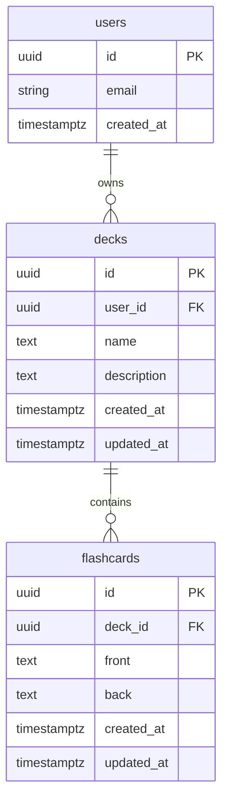

# Database Plan - 10xCards

## Overview

This document describes the database schema for 10xCards, an AI-powered educational flashcard generator.

## Database Provider

- **Provider:** Supabase (PostgreSQL)
- **Region:** Frankfurt (eu-central-1)
- **Features:** Row Level Security (RLS), Real-time subscriptions, Auth integration

## Entity Relationship Diagram



## Tables

### `decks`

Stores user-created flashcard decks.

| Column | Type | Constraints | Description |
|--------|------|-------------|-------------|
| `id` | `uuid` | PK, default `uuid_generate_v4()` | Unique deck identifier |
| `user_id` | `uuid` | FK → `auth.users`, NOT NULL, CASCADE DELETE | Owner of the deck |
| `name` | `text` | NOT NULL, 1-100 chars | Deck name |
| `description` | `text` | nullable | Optional deck description |
| `created_at` | `timestamptz` | NOT NULL, default `now()` | Creation timestamp |
| `updated_at` | `timestamptz` | NOT NULL, default `now()` | Last update timestamp |

**Indexes:**
- `idx_decks_user_id` on `user_id` - for efficient user deck queries

### `flashcards`

Stores individual flashcards within decks.

| Column | Type | Constraints | Description |
|--------|------|-------------|-------------|
| `id` | `uuid` | PK, default `uuid_generate_v4()` | Unique flashcard identifier |
| `deck_id` | `uuid` | FK → `decks`, NOT NULL, CASCADE DELETE | Parent deck |
| `front` | `text` | NOT NULL, min 1 char | Question/prompt side |
| `back` | `text` | NOT NULL, min 1 char | Answer side |
| `created_at` | `timestamptz` | NOT NULL, default `now()` | Creation timestamp |
| `updated_at` | `timestamptz` | NOT NULL, default `now()` | Last update timestamp |

**Indexes:**
- `idx_flashcards_deck_id` on `deck_id` - for efficient flashcard queries by deck

## Row Level Security (RLS) Policies

All tables have RLS enabled to ensure users can only access their own data.

### Decks Policies

| Policy Name | Operation | Rule |
|-------------|-----------|------|
| `Users can view own decks` | SELECT | `auth.uid() = user_id` |
| `Users can create own decks` | INSERT | `auth.uid() = user_id` |
| `Users can update own decks` | UPDATE | `auth.uid() = user_id` |
| `Users can delete own decks` | DELETE | `auth.uid() = user_id` |

### Flashcards Policies

| Policy Name | Operation | Rule |
|-------------|-----------|------|
| `Users can view flashcards in own decks` | SELECT | deck belongs to user |
| `Users can create flashcards in own decks` | INSERT | deck belongs to user |
| `Users can update flashcards in own decks` | UPDATE | deck belongs to user |
| `Users can delete flashcards in own decks` | DELETE | deck belongs to user |

## Triggers

### `update_updated_at_column`

Automatically updates the `updated_at` column when a row is modified.

Applied to:
- `decks` table
- `flashcards` table

## Migration Files

| File | Description |
|------|-------------|
| `20231213000000_create_tables.sql` | Initial schema with tables, indexes, RLS policies, and triggers |

## TypeScript Types

Types are defined in `src/db/database.types.ts`:

```typescript
// Row types (what you get from SELECT)
type Deck = {
  id: string;
  user_id: string;
  name: string;
  description: string | null;
  created_at: string;
  updated_at: string;
};

type Flashcard = {
  id: string;
  deck_id: string;
  front: string;
  back: string;
  created_at: string;
  updated_at: string;
};

// Insert types (what you pass to INSERT)
type DeckInsert = Omit<Deck, 'id' | 'created_at' | 'updated_at'> & {
  id?: string;
  created_at?: string;
  updated_at?: string;
};

type FlashcardInsert = Omit<Flashcard, 'id' | 'created_at' | 'updated_at'> & {
  id?: string;
  created_at?: string;
  updated_at?: string;
};
```

## Usage Examples

### Create a deck

```typescript
const { data, error } = await supabase
  .from('decks')
  .insert({ user_id: userId, name: 'My Deck' })
  .select()
  .single();
```

### Get user's decks

```typescript
const { data, error } = await supabase
  .from('decks')
  .select('*')
  .order('created_at', { ascending: false });
```

### Get flashcards for a deck

```typescript
const { data, error } = await supabase
  .from('flashcards')
  .select('*')
  .eq('deck_id', deckId)
  .order('created_at', { ascending: true });
```

### Create flashcard with AI generation

```typescript
const { data, error } = await supabase
  .from('flashcards')
  .insert(
    flashcards.map(fc => ({
      deck_id: deckId,
      front: fc.front,
      back: fc.back,
    }))
  )
  .select();
```
