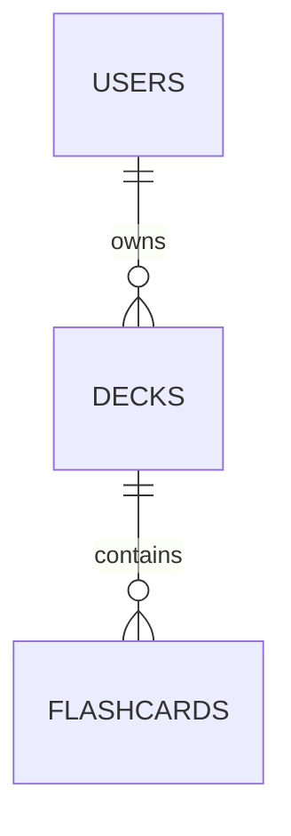
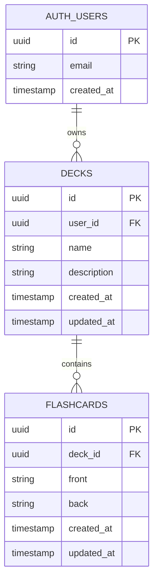

# 🎯 10xCards: Instrukcja Krok Po Kroku (Drugi Termin - 14.12.2025)

**Projekt:** Generator fiszek edukacyjnych z AI
**Termin oddania:** 14.12.2025 do 23:59
**Cel:** Wyróżnienie (wymaga: wszystkie wymagania obowiązkowe + opcjonalne + deployment)
**Szacowany czas realizacji:** 8-10 godzin

---

## 🧠 METODOLOGIE AI WIDOCZNE W REPOZYTORIUM

> **WAŻNE:** Te metodologie są widoczne przy ocenie projektu i pokazują, że stosujesz praktyki z kursu 10xDevs. Używaj ich przez cały proces!

### 1. Rules for AI (CLAUDE.md)
**Co to:** Plik z instrukcjami dla AI definiujący konwencje projektu.

**Gdzie:** `CLAUDE.md` w root projektu (dla Claude Code)

**Kiedy tworzyć:** Na samym początku projektu, po bootstrap.

> **TIP dla Claude Code:** Claude automatycznie czyta `CLAUDE.md` przy każdym uruchomieniu w projekcie!

### 2. Dokumentacja kontekstowa (.ai/)
**Co to:** Folder z dokumentami planistycznymi używanymi jako kontekst dla AI.

**Struktura:**
```
.ai/
├── prd.md                    # Product Requirements Document
├── tech-stack.md             # Stack technologiczny
├── db-plan.md                # Schemat bazy danych
├── api-plan.md               # Specyfikacja REST API
└── ui-plan.md                # Architektura UI (opcjonalnie)
```

### 3. Workflow 3x3 z Claude Code
**Co to:** Sweet spot między sprawczością agenta a Twoją kontrolą.

**Jak używać w Claude Code:**
```bash
# 1. Uruchom Claude w folderze projektu
cd ~/projects/10xcards
claude

# 2. Na końcu każdego promptu dodaj:
WAŻNE: Realizuj maksymalnie 3 kroki, podsumuj co zrobiłeś
i opisz plan na 3 kolejne - zatrzymaj się i czekaj na mój feedback.

# 3. Po sprawdzeniu zmian:
OK, kontynuuj

# 4. Jeśli coś jest nie tak:
Cofnij ostatnią zmianę i zrób to inaczej: [opis]
```

**Przydatne komendy Claude Code:**
```bash
/clear          # Wyczyść historię konwersacji
/compact        # Skompresuj kontekst (gdy za dużo)
/cost           # Pokaż zużycie tokenów
Ctrl+C          # Przerwij operację
```

### 4. XML Tags w promptach
**Co to:** Strukturyzacja promptów dla lepszej precyzji.

**Przykład:**
```xml
<project_description>
Generator fiszek edukacyjnych z AI
</project_description>

<implementation_plan>
@api-plan.md
</implementation_plan>

<implementation_rules>
@shared.mdc @backend.mdc
</implementation_rules>
```

### 5. Selektory data-testid w UI
**Co to:** Atrybuty ułatwiające testowanie E2E.

**Gdzie dodawać:**
```jsx
// ✅ Dobrze - wewnątrz komponentu
return <button data-testid="create-deck-button">Create Deck</button>
```

### 6. Diagramy Mermaid w dokumentacji
**Co to:** Tekstowa reprezentacja diagramów zrozumiała dla AI.

**Przykład w db-plan.md:**


---

## 📋 CHECKLIST WYMAGAŃ NA WYRÓŻNIENIE (Drugi Termin)

### ✅ Wymagania obowiązkowe:
- [ ] Mechanizm kontroli dostępu (ekran logowania) ✓ Supabase Auth
- [ ] CRUD - zarządzanie talami fiszek (decks) i fiszkami (flashcards)
- [ ] Logika biznesowa - generowanie fiszek z tekstu przez AI
- [ ] PRD i dokumenty kontekstowe w folderze `.ai/`
- [ ] Minimum 1 test (unit lub e2e)
- [ ] Pipeline CI/CD (GitHub Actions)

### ⭐ Wymagania opcjonalne (dla wyróżnienia):
- [ ] **Publiczny URL deployment** (Cloudflare Pages)

### 🎨 Dodatkowe (dla lepszego wrażenia):
- [ ] Responsywny design (mobile-friendly)
- [ ] Loading states i error handling
- [ ] System powtórek (spaced repetition - opcjonalnie)

---

## 🚀 PLAN REALIZACJI

### **DZIEŃ 1: Setup + Planowanie + Backend (4-5h)**

#### ⏰ Godzina 0:00-0:30 | Setup środowiska

**1. Załóż konta (jeśli nie masz):**
- [ ] GitHub account: https://github.com
- [ ] Supabase account: https://supabase.com
- [ ] OpenRouter.ai account: https://openrouter.ai
- [ ] Cloudflare account: https://dash.cloudflare.com

**2. Zainstaluj Claude Code (główne narzędzie):**

```bash
# 1. Zainstaluj globalnie
npm install -g @anthropic-ai/claude-code

# 2. Sprawdź instalację
claude --version

# 3. Zaloguj się (otworzy przeglądarkę)
claude

# 4. Przy pierwszym uruchomieniu wybierz:
#    - "No" dla "Help improve Claude" (prywatność)
```

> **WAŻNE:** Claude Code działa w terminalu i ma pełny dostęp do plików projektu. Jest idealny do Workflow 3x3!

**Alternatywy (jeśli wolisz IDE):**
- **Cursor:** https://cursor.com (Privacy Mode: ON)
- **VS Code + Copilot:** GitHub Copilot extension

**3. Zainstaluj Node.js:**
```bash
# Sprawdź wersję (potrzebujesz 18+):
node --version
npm --version

# Jeśli nie masz: https://nodejs.org/en/download
```

---

#### ⏰ Godzina 0:30-1:00 | Planowanie projektu (z metodologią AI)

> **METODOLOGIA:** Sesja planistyczna z AI (Moduł 2) + dokumentacja .ai/

**1. Wygeneruj PRD z AI (sesja planistyczna):**

Użyj Gemini 2.5 Pro (darmowy): https://aistudio.google.com

**Prompt z XML Tags:**
```xml
<role>
Jesteś product managerem dla aplikacji edukacyjnej.
</role>

<task>
Wygeneruj Product Requirements Document (PRD) dla aplikacji 10xCards - generator fiszek edukacyjnych z AI.
</task>

<functional_requirements>
- Użytkownik loguje się przez email/password (Supabase Auth)
- Może tworzyć talie fiszek (decks)
- Może dodawać fiszki ręcznie (front/back)
- Może wkleić tekst i wygenerować fiszki przez AI (OpenRouter)
- Może przeglądać, edytować i usuwać fiszki
- Może przeglądać fiszki w trybie nauki (flip cards)
</functional_requirements>

<tech_stack>
- Frontend: Astro + React + TypeScript + Tailwind
- Backend: Astro API routes
- Database: Supabase (PostgreSQL)
- Auth: Supabase Auth
- AI: OpenRouter.ai (Claude Haiku dla cost-effectiveness)
</tech_stack>

<output_format>
1. Problem Statement
2. User Stories (format: As a [user], I want to [action], so that [benefit])
3. Success Metrics
4. Technical Requirements
5. Out of Scope (co NIE robimy w MVP)
</output_format>

Zanim wygenerujesz PRD, zadaj mi 3-5 pytań doprecyzowujących,
które pomogą Ci lepiej zrozumieć kontekst projektu.
```

> **TIP:** Metoda Sokratejska - pozwól AI zadać pytania doprecyzowujące przed generowaniem.

**2. Stwórz strukturę dokumentacji .ai/:**
```bash
mkdir .ai
# Skopiuj wygenerowany PRD do .ai/prd.md
```

**3. Stwórz tech-stack.md:**

Stwórz plik `.ai/tech-stack.md`:
```markdown
# Tech Stack - 10xCards

## Frontend
- **Framework:** Astro 4.x (SSG + SSR hybrid)
- **UI Library:** React 18
- **Language:** TypeScript 5.x
- **Styling:** Tailwind CSS + shadcn/ui
- **Forms:** React Hook Form + Zod validation

## Backend
- **API:** Astro API routes (serverless)
- **Database:** Supabase (PostgreSQL)
- **Auth:** Supabase Auth (email/password)
- **AI:** OpenRouter.ai (Claude Haiku 3.5)

## Testing
- **Unit Tests:** Vitest
- **E2E Tests:** Playwright (optional)

## CI/CD
- **CI:** GitHub Actions
- **Deployment:** Cloudflare Pages

## Development Tools
- **IDE:** Cursor / VS Code
- **AI Assistant:** Claude Sonnet 4.5 / GitHub Copilot
- **Package Manager:** npm
```

---

#### ⏰ Godzina 1:00-1:30 | Bootstrap projektu

> **METODOLOGIA:** Bootstrap bez AI (Moduł 2) - używaj oficjalnych CLI, nie AI do generowania projektów od zera!

**Krok 1: Stwórz folder projektu**
```bash
cd ~/projects  # lub dowolny folder na projekty
mkdir 10xcards
cd 10xcards
```

**Krok 2: Pobierz starter (OPCJA A - rekomendowane)**
```bash
# Użyj degit - pobiera repo BEZ historii git (czyste repo)
npx degit przeprogramowani/10x-astro-starter .

# Zainstaluj zależności
npm install
```

> **Dlaczego degit a nie git clone?** `git clone` kopiuje całą historię commitów. `degit` pobiera tylko pliki - dzięki temu Twoje repo będzie miało czystą historię od pierwszego commita.

**Krok 2: Stwórz od zera (OPCJA B - jeśli starter nie działa)**
```bash
npm create astro@latest .
# Wybierz:
# - Template: Empty
# - TypeScript: Yes, strict
# - Install dependencies: Yes

npm install react react-dom
npm install -D @types/react @types/react-dom
npx astro add tailwind react
```

**Krok 3: Zainicjalizuj WŁASNE repozytorium Git**
```bash
# Upewnij się że NIE masz folderu .git (degit nie tworzy, ale dla pewności)
rm -rf .git 2>/dev/null

# Zainicjalizuj nowe repo
git init

# Stwórz .gitignore (jeśli nie ma)
cat > .gitignore << 'EOF'
node_modules/
dist/
.astro/
.env
.env.local
.env.production
.DS_Store
EOF

# Pierwszy commit
git add .
git commit -m "chore: initial project setup from 10x-astro-starter"
```

**Krok 4: Stwórz repo na GitHub**

**OPCJA A: Przez GitHub CLI (najszybciej)**
```bash
# Jeśli nie masz gh: https://cli.github.com/
gh repo create 10xcards --public --source=. --push
```

**OPCJA B: Przez przeglądarkę**
1. Idź na: https://github.com/new
2. **Repository name:** `10xcards`
3. **Visibility:** Public (lub Private + dodaj `@przeprogramowani` jako collaboratora)
4. **NIE zaznaczaj:** "Add README", "Add .gitignore", "Choose a license" (już masz lokalnie!)
5. Kliknij **"Create repository"**
6. GitHub pokaże komendy - wykonaj te dla "push an existing repository":
```bash
git remote add origin https://github.com/TWOJ-USERNAME/10xcards.git
git branch -M main
git push -u origin main
```

**Krok 5: Sprawdź czy wszystko działa**
```bash
npm run dev
# Otwórz http://localhost:4321 w przeglądarce
# Powinieneś zobaczyć stronę startową Astro
```

**Krok 6: Zweryfikuj repo na GitHub**
```bash
# Otwórz w przeglądarce
gh repo view --web
# LUB ręcznie: https://github.com/TWOJ-USERNAME/10xcards
```

> **SUKCES:** Masz własne repo z czystą historią Git. Każdy commit będzie Twój!

**2. Stwórz CLAUDE.md (KLUCZOWE dla oceny!):**

> **METODOLOGIA:** Rules for AI (Moduł 1-2) - widoczne w repo!

**Krok 1:** Wygeneruj reguły na https://10xrules.ai/
- Wybierz stack: Astro, React, TypeScript, Supabase, Tailwind
- Kliknij "Generate Rules"

**Krok 2:** Stwórz plik `CLAUDE.md` w root projektu:

```markdown
# CLAUDE.md - Rules for AI

## Project: 10xCards
Generator fiszek edukacyjnych z AI.

## Tech Stack
- Astro 4.x (SSG + SSR hybrid)
- TypeScript 5
- React 18
- Tailwind CSS + shadcn/ui
- Supabase (PostgreSQL + Auth)
- OpenRouter.ai (Claude Haiku)

## Project Structure
```
src/
├── pages/          # Astro pages
│   └── api/        # API endpoints
├── components/     # React/Astro components
├── lib/            # Utilities (supabase client)
└── types/          # TypeScript types
```

## Coding Practices
- Handle errors at the beginning of functions
- Use early returns for error conditions
- Place happy path last in function
- Always validate input with Zod
- Add data-testid attributes to interactive UI elements

## Commands
- `npm run dev` - Start development server
- `npm run build` - Build for production
- `npm test` - Run tests

## Documentation
- PRD: .ai/prd.md
- Database schema: .ai/db-plan.md
- API specification: .ai/api-plan.md
```

> **Claude Code automatycznie czyta CLAUDE.md** przy każdym uruchomieniu w projekcie!

**Alternatywnie dla Cursor:**
```bash
mkdir -p .cursor/rules
# Skopiuj reguły z 10xrules.ai do .cursor/rules/*.mdc
```

**Krok 3: Commit CLAUDE.md i dokumentację**
```bash
git add CLAUDE.md .ai/
git commit -m "docs: add CLAUDE.md rules and project documentation"
git push
```

---

#### ⏰ Godzina 1:30-2:30 | Supabase setup + Database schema

**1. Utwórz projekt Supabase:**
- Idź na: https://supabase.com/dashboard
- New Project
  - Name: `10xcards`
  - Database Password: (zapisz w bezpiecznym miejscu!)
  - Region: `Frankfurt (eu-central-1)` (dla Polski)
- Czekaj ~2 min na setup

**2. Pobierz credentials:**
- Settings → API
- Skopiuj:
  - `Project URL`
  - `anon/public` key

**3. Skonfiguruj lokalnie:**

Stwórz `.env`:
```env
PUBLIC_SUPABASE_URL=https://twoj-projekt.supabase.co
PUBLIC_SUPABASE_ANON_KEY=twoj_anon_klucz
OPENROUTER_API_KEY=  # dodamy później
```

Dodaj do `.gitignore`:
```
.env
.env.local
.env.production
node_modules/
dist/
.astro/
```

**4. Zaprojektuj schemat bazy:**

Supabase Dashboard → SQL Editor → New Query

**Wklej i uruchom:**
```sql
-- Enable UUID extension
create extension if not exists "uuid-ossp";

-- Users table (managed by Supabase Auth automatically)
-- auth.users already exists

-- Decks table (talie fiszek)
create table public.decks (
  id uuid primary key default uuid_generate_v4(),
  user_id uuid references auth.users(id) on delete cascade not null,
  name text not null check (char_length(name) >= 1 and char_length(name) <= 100),
  description text,
  created_at timestamp with time zone default now() not null,
  updated_at timestamp with time zone default now() not null
);

-- Flashcards table (fiszki)
create table public.flashcards (
  id uuid primary key default uuid_generate_v4(),
  deck_id uuid references public.decks(id) on delete cascade not null,
  front text not null check (char_length(front) >= 1),
  back text not null check (char_length(back) >= 1),
  created_at timestamp with time zone default now() not null,
  updated_at timestamp with time zone default now() not null
);

-- Create indexes for better performance
create index decks_user_id_idx on public.decks(user_id);
create index flashcards_deck_id_idx on public.flashcards(deck_id);

-- Enable Row Level Security (RLS)
alter table public.decks enable row level security;
alter table public.flashcards enable row level security;

-- RLS Policies for decks
create policy "Users can view their own decks"
  on public.decks for select
  using (auth.uid() = user_id);

create policy "Users can insert their own decks"
  on public.decks for insert
  with check (auth.uid() = user_id);

create policy "Users can update their own decks"
  on public.decks for update
  using (auth.uid() = user_id);

create policy "Users can delete their own decks"
  on public.decks for delete
  using (auth.uid() = user_id);

-- RLS Policies for flashcards
create policy "Users can view flashcards in their decks"
  on public.flashcards for select
  using (
    deck_id in (
      select id from public.decks where user_id = auth.uid()
    )
  );

create policy "Users can insert flashcards in their decks"
  on public.flashcards for insert
  with check (
    deck_id in (
      select id from public.decks where user_id = auth.uid()
    )
  );

create policy "Users can update flashcards in their decks"
  on public.flashcards for update
  using (
    deck_id in (
      select id from public.decks where user_id = auth.uid()
    )
  );

create policy "Users can delete flashcards in their decks"
  on public.flashcards for delete
  using (
    deck_id in (
      select id from public.decks where user_id = auth.uid()
    )
  );

-- Function to update updated_at timestamp
create or replace function update_updated_at_column()
returns trigger as $$
begin
  new.updated_at = now();
  return new;
end;
$$ language plpgsql;

-- Triggers for updated_at
create trigger update_decks_updated_at
  before update on public.decks
  for each row
  execute function update_updated_at_column();

create trigger update_flashcards_updated_at
  before update on public.flashcards
  for each row
  execute function update_updated_at_column();
```

**5. Wygeneruj TypeScript types:**
```bash
npm install -D supabase
npx supabase init
npx supabase login
npx supabase link --project-ref <twoj-project-ref>
# Project ref znajdziesz w Settings → General

npx supabase gen types typescript --local > src/types/database.types.ts
```

**6. Zapisz schemat w dokumentacji (z diagramem Mermaid!):**

> **METODOLOGIA:** Diagramy Mermaid (Moduł 3) - widoczne w repo!

Stwórz `.ai/db-plan.md`:
```markdown
# Database Schema - 10xCards

## Entity Relationship Diagram



## Tables

### `decks`
- `id`: UUID (PK)
- `user_id`: UUID (FK → auth.users)
- `name`: TEXT (1-100 chars)
- `description`: TEXT (nullable)
- `created_at`: TIMESTAMP
- `updated_at`: TIMESTAMP

### `flashcards`
- `id`: UUID (PK)
- `deck_id`: UUID (FK → decks)
- `front`: TEXT (question/prompt)
- `back`: TEXT (answer)
- `created_at`: TIMESTAMP
- `updated_at`: TIMESTAMP

## RLS Policies
- Users can only access their own decks
- Users can only access flashcards in their decks
- Cascade delete: deleting deck → deletes all flashcards

## Indexes
- `decks(user_id)` - for filtering user's decks
- `flashcards(deck_id)` - for filtering deck's flashcards
```

**7. Commit:**
```bash
git add .
git commit -m "feat: add database schema with RLS policies"
git push
```

---

#### ⏰ Godzina 2:30-3:30 | API endpoints (CRUD)

> **METODOLOGIA:** Workflow 3x3 + XML Tags (Moduł 2)

**1. Stwórz api-plan.md przed implementacją:**

Stwórz `.ai/api-plan.md`:
```markdown
# API Plan - 10xCards

## Endpoints

### Decks
| Method | Endpoint | Description |
|--------|----------|-------------|
| GET | /api/decks | List all user's decks |
| POST | /api/decks | Create new deck |
| GET | /api/decks/:id | Get single deck |
| PUT | /api/decks/:id | Update deck |
| DELETE | /api/decks/:id | Delete deck |

### Flashcards
| Method | Endpoint | Description |
|--------|----------|-------------|
| GET | /api/flashcards?deck_id=xxx | List flashcards for deck |
| POST | /api/flashcards | Create flashcard |
| GET | /api/flashcards/:id | Get single flashcard |
| PUT | /api/flashcards/:id | Update flashcard |
| DELETE | /api/flashcards/:id | Delete flashcard |

### AI Generation
| Method | Endpoint | Description |
|--------|----------|-------------|
| POST | /api/generate-flashcards | Generate flashcards from text |

## Authentication
- All endpoints require Bearer token in Authorization header
- Token from Supabase Auth session

## Validation
- Zod schemas for all request bodies
- Return 400 for validation errors
- Return 401 for unauthorized
- Return 404 for not found
```

**2. Zainstaluj dependencies:**
```bash
npm install @supabase/supabase-js zod
```

**3. Stwórz Supabase client:**

`src/lib/supabase.ts`:
```typescript
import { createClient } from '@supabase/supabase-js';
import type { Database } from '../types/database.types';

export const supabase = createClient<Database>(
  import.meta.env.PUBLIC_SUPABASE_URL,
  import.meta.env.PUBLIC_SUPABASE_ANON_KEY
);
```

**3. Wygeneruj API endpoints dla DECKS:**

`src/pages/api/decks/index.ts`:
```typescript
import type { APIRoute } from 'astro';
import { z } from 'zod';
import { supabase } from '../../../lib/supabase';

const CreateDeckSchema = z.object({
  name: z.string().min(1).max(100),
  description: z.string().optional(),
});

// GET /api/decks - list all user's decks
export const GET: APIRoute = async ({ request }) => {
  const authHeader = request.headers.get('authorization');
  if (!authHeader) {
    return new Response(JSON.stringify({ error: 'Unauthorized' }), {
      status: 401,
      headers: { 'Content-Type': 'application/json' },
    });
  }

  const token = authHeader.replace('Bearer ', '');
  const { data: { user }, error: authError } = await supabase.auth.getUser(token);

  if (authError || !user) {
    return new Response(JSON.stringify({ error: 'Unauthorized' }), {
      status: 401,
      headers: { 'Content-Type': 'application/json' },
    });
  }

  const { data, error } = await supabase
    .from('decks')
    .select('*')
    .eq('user_id', user.id)
    .order('created_at', { ascending: false });

  if (error) {
    return new Response(JSON.stringify({ error: error.message }), {
      status: 500,
      headers: { 'Content-Type': 'application/json' },
    });
  }

  return new Response(JSON.stringify({ data }), {
    status: 200,
    headers: { 'Content-Type': 'application/json' },
  });
};

// POST /api/decks - create new deck
export const POST: APIRoute = async ({ request }) => {
  const authHeader = request.headers.get('authorization');
  if (!authHeader) {
    return new Response(JSON.stringify({ error: 'Unauthorized' }), {
      status: 401,
      headers: { 'Content-Type': 'application/json' },
    });
  }

  const token = authHeader.replace('Bearer ', '');
  const { data: { user }, error: authError } = await supabase.auth.getUser(token);

  if (authError || !user) {
    return new Response(JSON.stringify({ error: 'Unauthorized' }), {
      status: 401,
      headers: { 'Content-Type': 'application/json' },
    });
  }

  const body = await request.json();
  const validation = CreateDeckSchema.safeParse(body);

  if (!validation.success) {
    return new Response(JSON.stringify({ error: validation.error.errors }), {
      status: 400,
      headers: { 'Content-Type': 'application/json' },
    });
  }

  const { data, error } = await supabase
    .from('decks')
    .insert([{ ...validation.data, user_id: user.id }])
    .select()
    .single();

  if (error) {
    return new Response(JSON.stringify({ error: error.message }), {
      status: 500,
      headers: { 'Content-Type': 'application/json' },
    });
  }

  return new Response(JSON.stringify({ data }), {
    status: 201,
    headers: { 'Content-Type': 'application/json' },
  });
};
```

**4. Endpoint dla pojedynczego deck:**

`src/pages/api/decks/[id].ts`:
```typescript
import type { APIRoute } from 'astro';
import { z } from 'zod';
import { supabase } from '../../../lib/supabase';

const UpdateDeckSchema = z.object({
  name: z.string().min(1).max(100).optional(),
  description: z.string().optional(),
});

// GET /api/decks/:id
export const GET: APIRoute = async ({ params, request }) => {
  const authHeader = request.headers.get('authorization');
  if (!authHeader) {
    return new Response(JSON.stringify({ error: 'Unauthorized' }), {
      status: 401,
      headers: { 'Content-Type': 'application/json' },
    });
  }

  const token = authHeader.replace('Bearer ', '');
  const { data: { user }, error: authError } = await supabase.auth.getUser(token);

  if (authError || !user) {
    return new Response(JSON.stringify({ error: 'Unauthorized' }), {
      status: 401,
      headers: { 'Content-Type': 'application/json' },
    });
  }

  const { data, error } = await supabase
    .from('decks')
    .select('*')
    .eq('id', params.id!)
    .eq('user_id', user.id)
    .single();

  if (error) {
    return new Response(JSON.stringify({ error: 'Deck not found' }), {
      status: 404,
      headers: { 'Content-Type': 'application/json' },
    });
  }

  return new Response(JSON.stringify({ data }), {
    status: 200,
    headers: { 'Content-Type': 'application/json' },
  });
};

// PUT /api/decks/:id
export const PUT: APIRoute = async ({ params, request }) => {
  const authHeader = request.headers.get('authorization');
  if (!authHeader) {
    return new Response(JSON.stringify({ error: 'Unauthorized' }), {
      status: 401,
      headers: { 'Content-Type': 'application/json' },
    });
  }

  const token = authHeader.replace('Bearer ', '');
  const { data: { user }, error: authError } = await supabase.auth.getUser(token);

  if (authError || !user) {
    return new Response(JSON.stringify({ error: 'Unauthorized' }), {
      status: 401,
      headers: { 'Content-Type': 'application/json' },
    });
  }

  const body = await request.json();
  const validation = UpdateDeckSchema.safeParse(body);

  if (!validation.success) {
    return new Response(JSON.stringify({ error: validation.error.errors }), {
      status: 400,
      headers: { 'Content-Type': 'application/json' },
    });
  }

  const { data, error } = await supabase
    .from('decks')
    .update(validation.data)
    .eq('id', params.id!)
    .eq('user_id', user.id)
    .select()
    .single();

  if (error) {
    return new Response(JSON.stringify({ error: error.message }), {
      status: 500,
      headers: { 'Content-Type': 'application/json' },
    });
  }

  return new Response(JSON.stringify({ data }), {
    status: 200,
    headers: { 'Content-Type': 'application/json' },
  });
};

// DELETE /api/decks/:id
export const DELETE: APIRoute = async ({ params, request }) => {
  const authHeader = request.headers.get('authorization');
  if (!authHeader) {
    return new Response(JSON.stringify({ error: 'Unauthorized' }), {
      status: 401,
      headers: { 'Content-Type': 'application/json' },
    });
  }

  const token = authHeader.replace('Bearer ', '');
  const { data: { user }, error: authError } = await supabase.auth.getUser(token);

  if (authError || !user) {
    return new Response(JSON.stringify({ error: 'Unauthorized' }), {
      status: 401,
      headers: { 'Content-Type': 'application/json' },
    });
  }

  const { error } = await supabase
    .from('decks')
    .delete()
    .eq('id', params.id!)
    .eq('user_id', user.id);

  if (error) {
    return new Response(JSON.stringify({ error: error.message }), {
      status: 500,
      headers: { 'Content-Type': 'application/json' },
    });
  }

  return new Response(null, { status: 204 });
};
```

**5. Użyj Claude Code do wygenerowania flashcards endpoints (Workflow 3x3):**

**Krok 1:** Otwórz terminal w folderze projektu i uruchom Claude:
```bash
cd ~/projects/10xcards
claude
```

**Krok 2:** Wklej prompt z Workflow 3x3:
```
Przeczytaj pliki:
- .ai/api-plan.md
- .ai/db-plan.md
- src/pages/api/decks/index.ts (jako wzorzec)

Zadanie: Wygeneruj API endpoints dla flashcards analogicznie do decks.

Pliki do stworzenia:
- src/pages/api/flashcards/index.ts
- src/pages/api/flashcards/[id].ts

Walidacja Zod:
- CreateFlashcardSchema: front (string, min 1), back (string, min 1), deck_id (uuid)
- UpdateFlashcardSchema: front (optional string), back (optional string)

Endpoints:
- GET /api/flashcards?deck_id=xxx - lista fiszek dla deck
- POST /api/flashcards - tworzenie fiszki
- GET /api/flashcards/:id - pojedyncza fiszka
- PUT /api/flashcards/:id - update fiszki
- DELETE /api/flashcards/:id - usunięcie

WAŻNE: Realizuj maksymalnie 3 kroki, podsumuj co zrobiłeś
i opisz plan na 3 kolejne - zatrzymaj się i czekaj na mój feedback.
```

**Krok 3:** Po każdych 3 krokach Claude się zatrzyma. Sprawdź zmiany:
```
# W Claude Code możesz napisać:
Pokaż diff zmian które zrobiłeś
```

**Krok 4:** Daj feedback i kontynuuj:
```
OK, kontynuuj z kolejnymi 3 krokami
```

> **TIP:** Workflow 3x3 daje Ci kontrolę nad tym, co AI robi. Możesz w każdej chwili powiedzieć "cofnij ostatnią zmianę"!

**6. Commit:**
```bash
git add .
git commit -m "feat: add CRUD API endpoints for decks and flashcards"
git push
```

---

### **DZIEŃ 2: Frontend + AI + Testing (4-5h)**

#### ⏰ Godzina 0:00-1:00 | Authentication UI

**1. Włącz Email Auth w Supabase:**
- Dashboard → Authentication → Providers
- Email: Enable (powinno być domyślnie)

**2. Stwórz komponent Login:**

`src/components/Login.tsx`:
```tsx
import { useState } from 'react';
import { supabase } from '../lib/supabase';

export default function Login() {
  const [email, setEmail] = useState('');
  const [password, setPassword] = useState('');
  const [loading, setLoading] = useState(false);
  const [error, setError] = useState<string | null>(null);
  const [mode, setMode] = useState<'login' | 'signup'>('login');

  const handleAuth = async (e: React.FormEvent) => {
    e.preventDefault();
    setLoading(true);
    setError(null);

    if (mode === 'login') {
      const { error } = await supabase.auth.signInWithPassword({
        email,
        password,
      });

      if (error) {
        setError(error.message);
      } else {
        window.location.href = '/dashboard';
      }
    } else {
      const { error } = await supabase.auth.signUp({
        email,
        password,
      });

      if (error) {
        setError(error.message);
      } else {
        alert('Check your email for confirmation link!');
        setMode('login');
      }
    }

    setLoading(false);
  };

  return (
    <div className="min-h-screen flex items-center justify-center bg-gradient-to-br from-blue-50 to-indigo-100 px-4">
      <div className="max-w-md w-full bg-white rounded-2xl shadow-xl p-8">
        <div className="text-center mb-8">
          <h1 className="text-4xl font-bold text-gray-900 mb-2">10xCards</h1>
          <p className="text-gray-600">AI-powered flashcards generator</p>
        </div>

        <form onSubmit={handleAuth} className="space-y-6">
          <div>
            <label htmlFor="email" className="block text-sm font-medium text-gray-700 mb-2">
              Email
            </label>
            <input
              id="email"
              type="email"
              placeholder="you@example.com"
              value={email}
              onChange={(e) => setEmail(e.target.value)}
              className="w-full px-4 py-3 border border-gray-300 rounded-lg focus:ring-2 focus:ring-indigo-500 focus:border-transparent transition"
              required
            />
          </div>

          <div>
            <label htmlFor="password" className="block text-sm font-medium text-gray-700 mb-2">
              Password
            </label>
            <input
              id="password"
              type="password"
              placeholder="••••••••"
              value={password}
              onChange={(e) => setPassword(e.target.value)}
              className="w-full px-4 py-3 border border-gray-300 rounded-lg focus:ring-2 focus:ring-indigo-500 focus:border-transparent transition"
              required
              minLength={6}
            />
          </div>

          {error && (
            <div className="bg-red-50 border border-red-200 text-red-700 px-4 py-3 rounded-lg text-sm">
              {error}
            </div>
          )}

          <button
            type="submit"
            disabled={loading}
            className="w-full bg-indigo-600 hover:bg-indigo-700 disabled:bg-indigo-400 text-white font-semibold py-3 rounded-lg transition duration-200"
          >
            {loading ? 'Loading...' : mode === 'login' ? 'Sign In' : 'Sign Up'}
          </button>

          <button
            type="button"
            onClick={() => setMode(mode === 'login' ? 'signup' : 'login')}
            className="w-full text-sm text-indigo-600 hover:text-indigo-800 transition"
          >
            {mode === 'login'
              ? "Don't have an account? Sign up"
              : 'Already have an account? Sign in'}
          </button>
        </form>
      </div>
    </div>
  );
}
```

**3. Stwórz stronę login:**

`src/pages/login.astro`:
```astro
---
import Login from '../components/Login';
---

<!DOCTYPE html>
<html lang="en">
  <head>
    <meta charset="UTF-8" />
    <meta name="viewport" content="width=device-width, initial-scale=1.0" />
    <title>Login - 10xCards</title>
  </head>
  <body>
    <Login client:load />
  </body>
</html>
```

**4. Stwórz middleware dla protected routes:**

`src/middleware/index.ts`:
```typescript
import { defineMiddleware } from 'astro:middleware';

export const onRequest = defineMiddleware(async ({ request, redirect, cookies }, next) => {
  const url = new URL(request.url);

  // Public routes
  const publicRoutes = ['/', '/login'];
  if (publicRoutes.includes(url.pathname)) {
    return next();
  }

  // Check authentication
  const accessToken = cookies.get('sb-access-token')?.value;
  const refreshToken = cookies.get('sb-refresh-token')?.value;

  if (!accessToken && !refreshToken) {
    return redirect('/login');
  }

  return next();
});
```

**5. Commit:**
```bash
git add .
git commit -m "feat: add authentication UI and protected routes"
git push
```

---

#### ⏰ Godzina 1:00-2:30 | Dashboard + CRUD UI

**1. Zainstaluj shadcn/ui (opcjonalnie):**
```bash
npx shadcn-ui@latest init
# Choose defaults

npx shadcn-ui@latest add button card input textarea dialog
```

**2. Użyj Claude Code do stworzenia Dashboard (z Workflow 3x3):**

> **METODOLOGIA:** Selektory data-testid (Moduł 3) - widoczne w kodzie!

**Uruchom Claude i wklej prompt:**
```
Przeczytaj pliki:
- .ai/db-plan.md
- src/lib/supabase.ts
- src/types/database.types.ts

Zadanie: Stwórz komponent Dashboard.tsx z następującymi funkcjami:
1. Lista talii (decks) użytkownika w sidebar
2. Formularz tworzenia nowej talii
3. Lista fiszek dla wybranej talii
4. Formularz dodawania fiszki
5. Usuwanie talii i fiszek

WYMAGANIA:
- Użyj Supabase SDK (nie fetch do API)
- Dodaj data-testid do wszystkich interaktywnych elementów
- Tailwind CSS dla stylów
- TypeScript z typami z database.types.ts

WAŻNE: Realizuj maksymalnie 3 kroki, podsumuj co zrobiłeś
i opisz plan na 3 kolejne - zatrzymaj się i czekaj na mój feedback.
```

**Przykładowy Dashboard (jeśli wolisz copy-paste):**

`src/components/Dashboard.tsx`:
```tsx
import { useState, useEffect } from 'react';
import { supabase } from '../lib/supabase';
import type { Database } from '../types/database.types';

type Deck = Database['public']['Tables']['decks']['Row'];
type Flashcard = Database['public']['Tables']['flashcards']['Row'];

export default function Dashboard() {
  const [decks, setDecks] = useState<Deck[]>([]);
  const [selectedDeck, setSelectedDeck] = useState<Deck | null>(null);
  const [flashcards, setFlashcards] = useState<Flashcard[]>([]);
  const [loading, setLoading] = useState(true);

  // Deck form state
  const [newDeckName, setNewDeckName] = useState('');
  const [newDeckDescription, setNewDeckDescription] = useState('');

  // Flashcard form state
  const [newCardFront, setNewCardFront] = useState('');
  const [newCardBack, setNewCardBack] = useState('');

  useEffect(() => {
    fetchDecks();
  }, []);

  useEffect(() => {
    if (selectedDeck) {
      fetchFlashcards(selectedDeck.id);
    }
  }, [selectedDeck]);

  const fetchDecks = async () => {
    const { data: { session } } = await supabase.auth.getSession();
    if (!session) return;

    const { data, error } = await supabase
      .from('decks')
      .select('*')
      .order('created_at', { ascending: false });

    if (!error && data) {
      setDecks(data);
      if (data.length > 0 && !selectedDeck) {
        setSelectedDeck(data[0]);
      }
    }
    setLoading(false);
  };

  const fetchFlashcards = async (deckId: string) => {
    const { data, error } = await supabase
      .from('flashcards')
      .select('*')
      .eq('deck_id', deckId)
      .order('created_at', { ascending: false });

    if (!error && data) {
      setFlashcards(data);
    }
  };

  const handleCreateDeck = async (e: React.FormEvent) => {
    e.preventDefault();
    if (!newDeckName.trim()) return;

    const { data, error } = await supabase
      .from('decks')
      .insert([{ name: newDeckName, description: newDeckDescription }])
      .select()
      .single();

    if (!error && data) {
      setDecks([data, ...decks]);
      setNewDeckName('');
      setNewDeckDescription('');
      setSelectedDeck(data);
    }
  };

  const handleDeleteDeck = async (id: string) => {
    if (!confirm('Are you sure? This will delete all flashcards in this deck.')) return;

    const { error } = await supabase.from('decks').delete().eq('id', id);

    if (!error) {
      setDecks(decks.filter((d) => d.id !== id));
      if (selectedDeck?.id === id) {
        setSelectedDeck(decks[0] || null);
      }
    }
  };

  const handleCreateFlashcard = async (e: React.FormEvent) => {
    e.preventDefault();
    if (!selectedDeck || !newCardFront.trim() || !newCardBack.trim()) return;

    const { data, error } = await supabase
      .from('flashcards')
      .insert([{
        deck_id: selectedDeck.id,
        front: newCardFront,
        back: newCardBack,
      }])
      .select()
      .single();

    if (!error && data) {
      setFlashcards([data, ...flashcards]);
      setNewCardFront('');
      setNewCardBack('');
    }
  };

  const handleDeleteFlashcard = async (id: string) => {
    const { error } = await supabase.from('flashcards').delete().eq('id', id);

    if (!error) {
      setFlashcards(flashcards.filter((fc) => fc.id !== id));
    }
  };

  const handleLogout = async () => {
    await supabase.auth.signOut();
    window.location.href = '/login';
  };

  if (loading) {
    return (
      <div className="min-h-screen flex items-center justify-center">
        <div className="text-lg">Loading...</div>
      </div>
    );
  }

  return (
    <div className="min-h-screen bg-gray-50" data-testid="dashboard">
      {/* Header */}
      <header className="bg-white border-b border-gray-200" data-testid="header">
        <div className="max-w-7xl mx-auto px-4 sm:px-6 lg:px-8 py-4 flex justify-between items-center">
          <h1 className="text-2xl font-bold text-gray-900">10xCards</h1>
          <button
            onClick={handleLogout}
            className="px-4 py-2 text-sm text-gray-600 hover:text-gray-900"
            data-testid="logout-button"
          >
            Logout
          </button>
        </div>
      </header>

      <div className="max-w-7xl mx-auto px-4 sm:px-6 lg:px-8 py-8">
        <div className="grid grid-cols-1 lg:grid-cols-3 gap-8">
          {/* Sidebar - Decks */}
          <div className="lg:col-span-1">
            <div className="bg-white rounded-lg shadow p-6">
              <h2 className="text-xl font-semibold mb-4">My Decks</h2>

              {/* Create Deck Form */}
              <form onSubmit={handleCreateDeck} className="mb-6 space-y-3" data-testid="create-deck-form">
                <input
                  type="text"
                  placeholder="Deck name"
                  value={newDeckName}
                  onChange={(e) => setNewDeckName(e.target.value)}
                  className="w-full px-3 py-2 border border-gray-300 rounded-md"
                  data-testid="deck-name-input"
                  required
                />
                <input
                  type="text"
                  placeholder="Description (optional)"
                  value={newDeckDescription}
                  onChange={(e) => setNewDeckDescription(e.target.value)}
                  className="w-full px-3 py-2 border border-gray-300 rounded-md"
                  data-testid="deck-description-input"
                />
                <button
                  type="submit"
                  className="w-full bg-indigo-600 hover:bg-indigo-700 text-white font-medium py-2 rounded-md"
                  data-testid="create-deck-button"
                >
                  Create Deck
                </button>
              </form>

              {/* Decks List */}
              <div className="space-y-2">
                {decks.map((deck) => (
                  <div
                    key={deck.id}
                    className={`p-3 rounded-md cursor-pointer transition ${
                      selectedDeck?.id === deck.id
                        ? 'bg-indigo-50 border border-indigo-200'
                        : 'bg-gray-50 hover:bg-gray-100'
                    }`}
                    onClick={() => setSelectedDeck(deck)}
                  >
                    <div className="flex justify-between items-start">
                      <div className="flex-1">
                        <h3 className="font-medium text-gray-900">{deck.name}</h3>
                        {deck.description && (
                          <p className="text-sm text-gray-500 mt-1">{deck.description}</p>
                        )}
                      </div>
                      <button
                        onClick={(e) => {
                          e.stopPropagation();
                          handleDeleteDeck(deck.id);
                        }}
                        className="text-red-500 hover:text-red-700 ml-2"
                      >
                        ×
                      </button>
                    </div>
                  </div>
                ))}
              </div>
            </div>
          </div>

          {/* Main Content - Flashcards */}
          <div className="lg:col-span-2">
            {selectedDeck ? (
              <div className="bg-white rounded-lg shadow p-6">
                <h2 className="text-xl font-semibold mb-4">{selectedDeck.name}</h2>

                {/* Create Flashcard Form */}
                <form onSubmit={handleCreateFlashcard} className="mb-6 space-y-3" data-testid="create-flashcard-form">
                  <input
                    type="text"
                    placeholder="Front (question)"
                    value={newCardFront}
                    onChange={(e) => setNewCardFront(e.target.value)}
                    className="w-full px-3 py-2 border border-gray-300 rounded-md"
                    data-testid="flashcard-front-input"
                    required
                  />
                  <textarea
                    placeholder="Back (answer)"
                    value={newCardBack}
                    onChange={(e) => setNewCardBack(e.target.value)}
                    className="w-full px-3 py-2 border border-gray-300 rounded-md"
                    data-testid="flashcard-back-input"
                    rows={3}
                    required
                  />
                  <button
                    type="submit"
                    className="bg-green-600 hover:bg-green-700 text-white font-medium px-4 py-2 rounded-md"
                    data-testid="add-flashcard-button"
                  >
                    Add Flashcard
                  </button>
                </form>

                {/* Flashcards List */}
                <div className="space-y-3">
                  {flashcards.length === 0 ? (
                    <p className="text-gray-500 text-center py-8">
                      No flashcards yet. Create one above or use AI to generate!
                    </p>
                  ) : (
                    flashcards.map((card) => (
                      <div key={card.id} className="border border-gray-200 rounded-md p-4">
                        <div className="flex justify-between items-start">
                          <div className="flex-1">
                            <div className="font-medium text-gray-900 mb-2">{card.front}</div>
                            <div className="text-gray-600">{card.back}</div>
                          </div>
                          <button
                            onClick={() => handleDeleteFlashcard(card.id)}
                            className="text-red-500 hover:text-red-700 ml-4"
                          >
                            Delete
                          </button>
                        </div>
                      </div>
                    ))
                  )}
                </div>
              </div>
            ) : (
              <div className="bg-white rounded-lg shadow p-6 text-center text-gray-500">
                Create a deck to get started
              </div>
            )}
          </div>
        </div>
      </div>
    </div>
  );
}
```

**3. Stwórz stronę dashboard:**

`src/pages/dashboard.astro`:
```astro
---
import Dashboard from '../components/Dashboard';
---

<!DOCTYPE html>
<html lang="en">
  <head>
    <meta charset="UTF-8" />
    <meta name="viewport" content="width=device-width, initial-scale=1.0" />
    <title>Dashboard - 10xCards</title>
  </head>
  <body>
    <Dashboard client:load />
  </body>
</html>
```

**4. Commit:**
```bash
git add .
git commit -m "feat: add dashboard with CRUD UI for decks and flashcards"
git push
```

---

#### ⏰ Godzina 2:30-3:30 | AI Integration

**1. Załóż konto OpenRouter:**
- Idź na: https://openrouter.ai/
- Sign Up przez GitHub/Google
- Settings → Keys → Create Key
- Skopiuj klucz do `.env`:
```env
OPENROUTER_API_KEY=sk-or-v1-xxxx
```

**2. Dodaj credit do OpenRouter:**
- Settings → Credits → Add $5 (wystarczy na development)

**3. Stwórz API endpoint do generowania:**

`src/pages/api/generate-flashcards.ts`:
```typescript
import type { APIRoute } from 'astro';
import { z } from 'zod';
import { supabase } from '../../lib/supabase';

const GenerateSchema = z.object({
  text: z.string().min(10).max(10000),
  deckId: z.string().uuid(),
  count: z.number().min(1).max(20).default(5),
});

export const POST: APIRoute = async ({ request }) => {
  const authHeader = request.headers.get('authorization');
  if (!authHeader) {
    return new Response(JSON.stringify({ error: 'Unauthorized' }), {
      status: 401,
      headers: { 'Content-Type': 'application/json' },
    });
  }

  const token = authHeader.replace('Bearer ', '');
  const { data: { user }, error: authError } = await supabase.auth.getUser(token);

  if (authError || !user) {
    return new Response(JSON.stringify({ error: 'Unauthorized' }), {
      status: 401,
      headers: { 'Content-Type': 'application/json' },
    });
  }

  const body = await request.json();
  const validation = GenerateSchema.safeParse(body);

  if (!validation.success) {
    return new Response(JSON.stringify({ error: validation.error.errors }), {
      status: 400,
      headers: { 'Content-Type': 'application/json' },
    });
  }

  const { text, deckId, count } = validation.data;

  // Verify deck ownership
  const { data: deck, error: deckError } = await supabase
    .from('decks')
    .select('id')
    .eq('id', deckId)
    .eq('user_id', user.id)
    .single();

  if (deckError || !deck) {
    return new Response(JSON.stringify({ error: 'Deck not found' }), {
      status: 404,
      headers: { 'Content-Type': 'application/json' },
    });
  }

  // Call OpenRouter API
  try {
    const response = await fetch('https://openrouter.ai/api/v1/chat/completions', {
      method: 'POST',
      headers: {
        'Authorization': `Bearer ${import.meta.env.OPENROUTER_API_KEY}`,
        'Content-Type': 'application/json',
        'HTTP-Referer': request.headers.get('referer') || 'https://10xcards.app',
        'X-Title': '10xCards',
      },
      body: JSON.stringify({
        model: 'anthropic/claude-3.5-haiku', // budżetowy model
        messages: [
          {
            role: 'user',
            content: `Generate exactly ${count} educational flashcards from the following text.

Return ONLY a valid JSON array with no additional text, following this exact format:
[
  {"front": "Question or term", "back": "Answer or definition"},
  {"front": "Question or term", "back": "Answer or definition"}
]

Requirements:
- Each flashcard should have a clear, concise question/term on the front
- The back should have a complete, accurate answer/definition
- Focus on key concepts and important information
- Make questions specific and testable
- Vary question types (what, how, why, define, etc.)

Text to process:
${text}`,
          },
        ],
        temperature: 0.7,
        max_tokens: 2000,
      }),
    });

    if (!response.ok) {
      const error = await response.text();
      console.error('OpenRouter error:', error);
      return new Response(JSON.stringify({ error: 'Failed to generate flashcards' }), {
        status: 500,
        headers: { 'Content-Type': 'application/json' },
      });
    }

    const data = await response.json();
    const content = data.choices[0].message.content;

    // Parse AI response
    let flashcards;
    try {
      // Try to extract JSON from markdown code blocks
      const jsonMatch = content.match(/```(?:json)?\s*(\[[\s\S]*?\])\s*```/);
      const jsonString = jsonMatch ? jsonMatch[1] : content;
      flashcards = JSON.parse(jsonString);
    } catch (e) {
      console.error('Failed to parse AI response:', content);
      return new Response(JSON.stringify({ error: 'Failed to parse AI response' }), {
        status: 500,
        headers: { 'Content-Type': 'application/json' },
      });
    }

    // Validate flashcards structure
    if (!Array.isArray(flashcards) || flashcards.length === 0) {
      return new Response(JSON.stringify({ error: 'Invalid flashcards format' }), {
        status: 500,
        headers: { 'Content-Type': 'application/json' },
      });
    }

    // Insert flashcards into database
    const { data: insertedCards, error: insertError } = await supabase
      .from('flashcards')
      .insert(
        flashcards.map((fc: any) => ({
          deck_id: deckId,
          front: fc.front,
          back: fc.back,
        }))
      )
      .select();

    if (insertError) {
      return new Response(JSON.stringify({ error: insertError.message }), {
        status: 500,
        headers: { 'Content-Type': 'application/json' },
      });
    }

    return new Response(
      JSON.stringify({
        success: true,
        count: insertedCards?.length || 0,
        flashcards: insertedCards,
      }),
      {
        status: 201,
        headers: { 'Content-Type': 'application/json' },
      }
    );
  } catch (error: any) {
    console.error('Generate flashcards error:', error);
    return new Response(JSON.stringify({ error: error.message }), {
      status: 500,
      headers: { 'Content-Type': 'application/json' },
    });
  }
};
```

**4. Dodaj UI do generowania w Dashboard:**

Dodaj do `src/components/Dashboard.tsx` (przed Create Flashcard Form):

```tsx
// Dodaj state na początku komponentu:
const [generateText, setGenerateText] = useState('');
const [generating, setGenerating] = useState(false);
const [generateCount, setGenerateCount] = useState(5);

// Dodaj funkcję:
const handleGenerateFlashcards = async () => {
  if (!selectedDeck || !generateText.trim()) return;

  setGenerating(true);

  try {
    const { data: { session } } = await supabase.auth.getSession();
    if (!session) return;

    const response = await fetch('/api/generate-flashcards', {
      method: 'POST',
      headers: {
        'Content-Type': 'application/json',
        'Authorization': `Bearer ${session.access_token}`,
      },
      body: JSON.stringify({
        text: generateText,
        deckId: selectedDeck.id,
        count: generateCount,
      }),
    });

    if (response.ok) {
      const result = await response.json();
      alert(`Generated ${result.count} flashcards!`);
      setGenerateText('');
      fetchFlashcards(selectedDeck.id);
    } else {
      const error = await response.json();
      alert(`Error: ${error.error}`);
    }
  } catch (error) {
    console.error('Generate error:', error);
    alert('Failed to generate flashcards');
  } finally {
    setGenerating(false);
  }
};

// Dodaj JSX przed Create Flashcard Form:
{/* AI Generate Section */}
<div className="mb-6 p-4 bg-gradient-to-r from-purple-50 to-pink-50 border border-purple-200 rounded-lg" data-testid="ai-generate-section">
  <h3 className="font-semibold text-purple-900 mb-3">🤖 Generate with AI</h3>
  <div className="space-y-3">
    <div>
      <label className="block text-sm font-medium text-gray-700 mb-1">
        Number of flashcards
      </label>
      <input
        type="number"
        min="1"
        max="20"
        value={generateCount}
        onChange={(e) => setGenerateCount(parseInt(e.target.value) || 5)}
        className="w-full px-3 py-2 border border-gray-300 rounded-md"
        data-testid="generate-count-input"
      />
    </div>
    <textarea
      placeholder="Paste your text here (article, notes, etc.)..."
      value={generateText}
      onChange={(e) => setGenerateText(e.target.value)}
      className="w-full px-3 py-2 border border-gray-300 rounded-md"
      data-testid="generate-text-input"
      rows={6}
    />
    <button
      onClick={handleGenerateFlashcards}
      disabled={generating || !generateText.trim()}
      className="w-full bg-purple-600 hover:bg-purple-700 disabled:bg-purple-400 text-white font-medium py-2 rounded-md"
      data-testid="generate-flashcards-button"
    >
      {generating ? 'Generating...' : `Generate ${generateCount} Flashcards with AI`}
    </button>
  </div>
</div>
```

**5. Test AI generation:**
- Uruchom dev server: `npm run dev`
- Zaloguj się
- Wklej przykładowy tekst (np. artykuł Wikipedii)
- Kliknij "Generate"

**6. Commit:**
```bash
git add .
git commit -m "feat: add AI flashcard generation with OpenRouter"
git push
```

---

#### ⏰ Godzina 3:30-4:00 | Testy

**Wybierz JEDNĄ opcję:**

**OPCJA A: Test jednostkowy (Vitest) - 30 min**

```bash
npm install -D vitest @vitest/ui
```

Stwórz `vitest.config.ts`:
```typescript
import { defineConfig } from 'vitest/config';

export default defineConfig({
  test: {
    globals: true,
    environment: 'node',
  },
});
```

Stwórz `src/lib/flashcard-parser.test.ts`:
```typescript
import { describe, it, expect } from 'vitest';

// Helper function to validate flashcard format
export function validateFlashcard(flashcard: any): boolean {
  return (
    typeof flashcard === 'object' &&
    typeof flashcard.front === 'string' &&
    typeof flashcard.back === 'string' &&
    flashcard.front.length > 0 &&
    flashcard.back.length > 0
  );
}

// Helper to parse flashcards from text (simple implementation)
export function parseFlashcardsFromText(text: string): Array<{ front: string; back: string }> {
  const lines = text.split('\n').filter((line) => line.trim());
  const flashcards: Array<{ front: string; back: string }> = [];

  for (const line of lines) {
    const parts = line.split('|');
    if (parts.length === 2) {
      flashcards.push({
        front: parts[0].trim(),
        back: parts[1].trim(),
      });
    }
  }

  return flashcards;
}

describe('Flashcard Utilities', () => {
  describe('validateFlashcard', () => {
    it('should validate correct flashcard format', () => {
      const flashcard = {
        front: 'What is AI?',
        back: 'Artificial Intelligence',
      };
      expect(validateFlashcard(flashcard)).toBe(true);
    });

    it('should reject flashcard with missing front', () => {
      const flashcard = {
        back: 'Answer',
      };
      expect(validateFlashcard(flashcard)).toBe(false);
    });

    it('should reject flashcard with empty strings', () => {
      const flashcard = {
        front: '',
        back: 'Answer',
      };
      expect(validateFlashcard(flashcard)).toBe(false);
    });
  });

  describe('parseFlashcardsFromText', () => {
    it('should parse pipe-separated flashcards', () => {
      const input = 'What is AI?|Artificial Intelligence\nWhat is ML?|Machine Learning';
      const result = parseFlashcardsFromText(input);

      expect(result).toHaveLength(2);
      expect(result[0]).toEqual({
        front: 'What is AI?',
        back: 'Artificial Intelligence',
      });
      expect(result[1]).toEqual({
        front: 'What is ML?',
        back: 'Machine Learning',
      });
    });

    it('should handle empty input', () => {
      const result = parseFlashcardsFromText('');
      expect(result).toEqual([]);
    });

    it('should skip invalid lines', () => {
      const input = 'Valid|Flashcard\nInvalidLine\nAnother|Valid';
      const result = parseFlashcardsFromText(input);

      expect(result).toHaveLength(2);
    });
  });
});
```

Dodaj do `package.json`:
```json
{
  "scripts": {
    "test": "vitest run",
    "test:watch": "vitest",
    "test:ui": "vitest --ui"
  }
}
```

Uruchom:
```bash
npm test
```

**OPCJA B: Test E2E (Playwright) - 45 min**

```bash
npm install -D @playwright/test
npx playwright install chromium
```

Stwórz `playwright.config.ts`:
```typescript
import { defineConfig } from '@playwright/test';

export default defineConfig({
  testDir: './tests',
  use: {
    baseURL: 'http://localhost:4321',
    screenshot: 'only-on-failure',
    video: 'retain-on-failure',
  },
  webServer: {
    command: 'npm run dev',
    port: 4321,
    reuseExistingServer: true,
  },
});
```

Stwórz `tests/flashcards.spec.ts`:
```typescript
import { test, expect } from '@playwright/test';

test.describe('10xCards E2E', () => {
  test('user can sign up, create deck, and add flashcard', async ({ page }) => {
    const timestamp = Date.now();
    const testEmail = `test${timestamp}@example.com`;
    const testPassword = 'TestPassword123!';

    // 1. Navigate to login page
    await page.goto('/login');

    // 2. Sign up
    await page.fill('input[type="email"]', testEmail);
    await page.fill('input[type="password"]', testPassword);
    await page.click('text=Sign up');
    await page.waitForTimeout(1000);

    // 3. Sign in
    await page.click('text=Sign in');
    await page.fill('input[type="email"]', testEmail);
    await page.fill('input[type="password"]', testPassword);
    await page.click('button:has-text("Sign In")');

    // 4. Should redirect to dashboard
    await expect(page).toHaveURL('/dashboard');

    // 5. Create a deck
    await page.fill('input[placeholder="Deck name"]', 'Test Deck');
    await page.fill('input[placeholder="Description (optional)"]', 'E2E Test');
    await page.click('button:has-text("Create Deck")');

    // 6. Verify deck appears
    await expect(page.locator('text=Test Deck')).toBeVisible();

    // 7. Add a flashcard
    await page.fill('input[placeholder="Front (question)"]', 'What is testing?');
    await page.fill('textarea[placeholder="Back (answer)"]', 'Verifying software works correctly');
    await page.click('button:has-text("Add Flashcard")');

    // 8. Verify flashcard appears
    await expect(page.locator('text=What is testing?')).toBeVisible();
    await expect(page.locator('text=Verifying software works correctly')).toBeVisible();
  });
});
```

Dodaj do `package.json`:
```json
{
  "scripts": {
    "test:e2e": "playwright test",
    "test:e2e:ui": "playwright test --ui"
  }
}
```

Uruchom:
```bash
npm run test:e2e
```

**7. Commit:**
```bash
git add .
git commit -m "test: add unit/e2e tests for flashcard functionality"
git push
```

---

#### ⏰ Godzina 4:00-4:45 | CI/CD Setup

**1. Stwórz GitHub Actions workflow:**

`.github/workflows/ci.yml`:
```yaml
name: CI/CD Pipeline

on:
  push:
    branches: [main]
  pull_request:
    branches: [main]

jobs:
  build-and-test:
    runs-on: ubuntu-latest

    steps:
      - name: Checkout code
        uses: actions/checkout@v4

      - name: Setup Node.js
        uses: actions/setup-node@v4
        with:
          node-version: '22'
          cache: 'npm'

      - name: Install dependencies
        run: npm ci

      - name: Run linter
        run: npm run lint || echo "No linter configured"
        continue-on-error: true

      - name: Run tests
        run: npm test
        env:
          PUBLIC_SUPABASE_URL: ${{ secrets.PUBLIC_SUPABASE_URL }}
          PUBLIC_SUPABASE_ANON_KEY: ${{ secrets.PUBLIC_SUPABASE_ANON_KEY }}
          OPENROUTER_API_KEY: ${{ secrets.OPENROUTER_API_KEY }}

      - name: Build project
        run: npm run build
        env:
          PUBLIC_SUPABASE_URL: ${{ secrets.PUBLIC_SUPABASE_URL }}
          PUBLIC_SUPABASE_ANON_KEY: ${{ secrets.PUBLIC_SUPABASE_ANON_KEY }}

      - name: Upload build artifacts
        uses: actions/upload-artifact@v3
        with:
          name: dist
          path: dist/
```

**2. Dodaj Secrets do GitHub:**
- GitHub repo → Settings → Secrets and variables → Actions
- New repository secret:
  - `PUBLIC_SUPABASE_URL` = twój URL
  - `PUBLIC_SUPABASE_ANON_KEY` = twój klucz
  - `OPENROUTER_API_KEY` = twój klucz

**3. Commit i sprawdź:**
```bash
git add .github/workflows/ci.yml
git commit -m "ci: add GitHub Actions workflow for testing and building"
git push
```

Sprawdź: GitHub → zakładka Actions → zobacz czy przeszło ✅

---

#### ⏰ Godzina 4:45-5:30 | Deployment (WYMAGANE dla wyróżnienia!)

**1. Załóż konto Cloudflare:**
- https://dash.cloudflare.com/sign-up
- Weryfikuj email

**2. Połącz repo z Cloudflare Pages:**
- Dashboard → Pages → Create a project
- Connect to Git → wybierz GitHub
- Autoryzuj Cloudflare
- Wybierz repo `10xcards`

**3. Konfiguracja build:**
- Framework preset: **Astro**
- Build command: `npm run build`
- Build output directory: `dist`

**4. Environment variables:**
Dodaj w Cloudflare Pages → Settings → Environment variables:
- `PUBLIC_SUPABASE_URL` = https://twoj-projekt.supabase.co
- `PUBLIC_SUPABASE_ANON_KEY` = twój_klucz
- `OPENROUTER_API_KEY` = sk-or-xxx
- `NODE_VERSION` = 22

**5. Deploy:**
- Save and Deploy
- Czekaj ~2-3 min

**6. Sprawdź:**
- Po build otrzymasz URL: https://10xcards-xxx.pages.dev
- Otwórz w przeglądarce
- Przetestuj logowanie i tworzenie fiszek

**7. Custom domain (opcjonalnie):**
- Cloudflare Pages → Custom domains
- Add domain (jeśli masz własną domenę)

**8. Zapisz URL deployment:**

Dodaj do README.md:
```markdown
## Live Demo

🚀 **Deployed at:** https://10xcards-xxx.pages.dev

## Features
- ✅ User authentication (Supabase Auth)
- ✅ CRUD operations for decks and flashcards
- ✅ AI-powered flashcard generation (OpenRouter + Claude)
- ✅ Responsive design
- ✅ Automated testing
- ✅ CI/CD pipeline
```

**9. Commit:**
```bash
git add README.md
git commit -m "docs: add deployment URL to README"
git push
```

---

### **DZIEŃ 3: Dokumentacja + Zgłoszenie (1h)**

#### ⏰ Final Steps

**1. Uzupełnij dokumentację:**

Upewnij się że masz:
- [ ] `.ai/prd.md` - Product Requirements Document
- [ ] `.ai/tech-stack.md` - Stack technologiczny
- [ ] `.ai/database-schema.md` - Schemat bazy danych
- [ ] `README.md` - Instrukcje uruchomienia

**2. Zrób screenshots:**

Zrób 6 screenshotów (wymagane w formularzu):

1. **Ekran logowania** - `/login`
   ```
   Screenshot: Formularz z email/password + buttony Sign In/Sign Up
   ```

2. **Strona główna / Dashboard** - `/dashboard`
   ```
   Screenshot: Widok z sidebar (decks) + main panel (flashcards)
   ```

3. **Funkcjonalność #1: Tworzenie decka**
   ```
   Screenshot: Formularz "Create Deck" z wypełnionymi polami
   ```

4. **Funkcjonalność #2: Generowanie z AI**
   ```
   Screenshot: Sekcja "Generate with AI" z przykładowym tekstem
   ```

5. **Test działający**
   ```
   Screenshot: Terminal z `npm test` - wszystkie testy zielone
   LUB Playwright UI z passing tests
   ```

6. **CI/CD pipeline**
   ```
   Screenshot: GitHub Actions - zielony checkmark + build log
   ```

Zapisz w `docs/screenshots/`:
```bash
mkdir -p docs/screenshots
# Wrzuć pliki:
# - 01-login.png
# - 02-dashboard.png
# - 03-create-deck.png
# - 04-ai-generate.png
# - 05-tests.png
# - 06-cicd.png
```

**3. Stwórz `.env.example`:**

```env
PUBLIC_SUPABASE_URL=https://your-project.supabase.co
PUBLIC_SUPABASE_ANON_KEY=your_anon_key_here
OPENROUTER_API_KEY=sk-or-v1-your-key-here
NODE_VERSION=22
```

**4. Final commit:**
```bash
git add .
git commit -m "docs: add screenshots and environment example"
git push
```

**5. Zgłoś projekt:**

Formularz: https://baserow.io/form/LqECKulaoa0jtHnmOwMyU6POggXWUKCm5OIo1KkyMX8

Wypełnij:
- Email: twój email
- Imię i nazwisko
- Typ projektu: **10xCards (własna wersja)**
- Zgoda na promocję: ✅
- Repozytorium: https://github.com/twoj-username/10xcards
- Publiczny URL: https://10xcards-xxx.pages.dev
- Screenshots: załącz wszystkie 6

Komentarz (przykład):
```
Aplikacja 10xCards - generator fiszek edukacyjnych z AI.

Funkcjonalności:
- Autentykacja przez Supabase Auth
- CRUD dla talii fiszek (decks) i fiszek (flashcards)
- Generowanie fiszek z tekstu przez AI (OpenRouter + Claude Haiku)
- Testy jednostkowe (Vitest)
- CI/CD pipeline (GitHub Actions)
- Deployment na Cloudflare Pages

Stack: Astro + React + TypeScript + Tailwind + Supabase + OpenRouter
```

---

## ✅ FINAL CHECKLIST PRZED ZGŁOSZENIEM

### Wymagania obowiązkowe:
- [ ] ✅ Ekran logowania działa (można się zalogować i zarejestrować)
- [ ] ✅ CRUD dla decks działa (create, read, update, delete)
- [ ] ✅ CRUD dla flashcards działa
- [ ] ✅ AI generowanie fiszek działa (OpenRouter)
- [ ] ✅ PRD w `.ai/prd.md`
- [ ] ✅ Tech stack w `.ai/tech-stack.md`
- [ ] ✅ Minimum 1 test przechodzi (`npm test`)
- [ ] ✅ GitHub Actions pipeline działa (zielony checkmark)

### Wymagania opcjonalne (dla wyróżnienia):
- [ ] ✅ Publiczny URL deployment (Cloudflare Pages)

### 🧠 Metodologie AI widoczne w repo (BONUS dla oceny!):
- [ ] ✅ **CLAUDE.md** - Rules for AI w root projektu
- [ ] ✅ **Dokumentacja .ai/** - prd.md, tech-stack.md, db-plan.md, api-plan.md
- [ ] ✅ **Diagramy Mermaid** - w db-plan.md (ERD)
- [ ] ✅ **Selektory data-testid** - w komponentach UI
- [ ] ✅ **Conventional Commits** - sensowne opisy commitów (feat:, fix:, docs:)

### Dokumentacja:
- [ ] ✅ README z instrukcjami uruchomienia
- [ ] ✅ `.env.example` z listą zmiennych
- [ ] ✅ 6 screenshotów w `docs/screenshots/`
- [ ] ✅ Database schema w `.ai/db-plan.md`

### Zgłoszenie:
- [ ] ✅ Formularz wypełniony
- [ ] ✅ Wszystkie screenshots załączone
- [ ] ✅ Repo publiczne LUB @przeprogramowani dodany jako collaborator
- [ ] ✅ URL deployment działa

---

## 🎯 TIPS & TRICKS

### 🧠 Claude Code - szybka ściągawka:

| Komenda | Działanie |
|---------|-----------|
| `claude` | Uruchom Claude Code w bieżącym folderze |
| `/clear` | Wyczyść historię konwersacji |
| `/compact` | Skompresuj kontekst (gdy za dużo tokenów) |
| `/cost` | Pokaż zużycie tokenów |
| `Ctrl+C` | Przerwij bieżącą operację |

### 🧠 Metodologie AI - szybkie przypomnienie:

| Metodologia | Gdzie widoczna | Kiedy używać |
|-------------|----------------|--------------|
| **CLAUDE.md** | Root projektu | Od początku projektu |
| **Workflow 3x3** | W promptach | Przy implementacji funkcji |
| **Dokumentacja .ai/** | `.ai/*.md` | Planowanie każdej warstwy |
| **Mermaid** | db-plan.md | Wizualizacja architektury |
| **data-testid** | Komponenty React | Przy tworzeniu UI |

### Jeśli coś nie działa:

**Problem: Tests fail w CI/CD**
- Sprawdź czy secrets są dodane w GitHub
- Upewnij się że `.env` NIE jest commitowany
- Sprawdź logi w Actions

**Problem: Deployment nie działa**
- Sprawdź build logi w Cloudflare Pages
- Upewnij się że env variables są ustawione
- Sprawdź czy `NODE_VERSION` = 22

**Problem: AI nie generuje fiszek**
- Sprawdź czy masz credit w OpenRouter
- Sprawdź API key w `.env`
- Sprawdź console w przeglądarce (F12)
- Sprawdź network tab - response z `/api/generate-flashcards`

**Problem: Supabase Auth nie działa**
- Sprawdź czy Email Auth jest włączony w Dashboard
- Sprawdź czy RLS policies są poprawne
- Sprawdź Session w Storage (F12 → Application → Local Storage)

### Zaoszczędź czas z Claude Code:

1. **Szablon promptu z Workflow 3x3:**
   ```
   Przeczytaj pliki: [lista plików kontekstowych]

   Zadanie: [opis zadania]

   WAŻNE: Realizuj maksymalnie 3 kroki, podsumuj co zrobiłeś
   i opisz plan na 3 kolejne - zatrzymaj się i czekaj na mój feedback.
   ```

2. **Szybkie komendy w Claude Code:**
   ```bash
   # Zamiast pisać "przeczytaj plik X" możesz:
   cat .ai/api-plan.md | claude "Zaimplementuj ten endpoint"

   # Lub w konwersacji:
   Przeczytaj .ai/api-plan.md i zaimplementuj endpoint /api/decks
   ```

3. **Testuj na bieżąco:**
   ```bash
   # W osobnym terminalu:
   npm run dev

   # Claude może testować curl:
   Przetestuj endpoint GET /api/decks z curl
   ```

4. **Commituj często (Conventional Commits):**
   ```bash
   # Możesz poprosić Claude:
   Zrób commit z opisem "feat: add deck CRUD API endpoints"
   ```

5. **Jeśli Claude się gubi - ratuj kontekst:**
   ```
   Podsumuj swoją pracę w pliku .ai/decks-implementation-status.md
   ```
   Potem: `/clear` i nowa konwersacja z referencją do tego pliku.

6. **Przydatne prompty dla Claude Code:**
   ```
   # Sprawdź co zrobiłeś:
   Pokaż diff wszystkich zmienionych plików

   # Cofnij zmiany:
   Cofnij ostatnią zmianę w pliku X

   # Debuguj:
   Uruchom npm run dev i pokaż mi błędy
   ```

---

## 📊 TIMELINE PODSUMOWANIE

**Dzień 1 (4-5h):**
- 0:00-0:30: Setup środowiska ✅
- 0:30-1:00: Planowanie z AI (PRD, tech-stack) → `.ai/prd.md`, `.ai/tech-stack.md` ✅
- 1:00-1:30: Bootstrap + **Rules for AI** → `.cursor/rules/*.mdc` ✅
- 1:30-2:30: Supabase + Database → `.ai/db-plan.md` z **Mermaid** ✅
- 2:30-3:30: API endpoints z **Workflow 3x3** → `.ai/api-plan.md` ✅

**Dzień 2 (4-5h):**
- 0:00-1:00: Authentication UI z **data-testid** ✅
- 1:00-2:30: Dashboard + CRUD UI z **data-testid** ✅
- 2:30-3:30: AI Integration ✅
- 3:30-4:00: Testy (Vitest/Playwright) ✅
- 4:00-4:45: CI/CD (GitHub Actions) ✅
- 4:45-5:30: Deployment (Cloudflare Pages) ✅

**Dzień 3 (1h):**
- Dokumentacja + Screenshots + Zgłoszenie ✅

**TOTAL: 9-11h** (z buforem na debugging)

**Artefakty do stworzenia (widoczne przy ocenie):**
```
CLAUDE.md               # Rules for AI (Claude Code czyta automatycznie!)

.ai/
├── prd.md              # PRD z AI
├── tech-stack.md       # Stack technologiczny
├── db-plan.md          # Schemat DB z Mermaid
└── api-plan.md         # Specyfikacja API
```

---

## 🏆 KRYTERIA WYRÓŻNIENIA (Przypomnienie)

**Drugi termin (14.12.2025):**
- Najlepsze projekty pod względem **pomysłowości** i **wykonania**
- Arbitralna decyzja mentorów
- **WSZYSTKIE wymagania** (obowiązkowe + opcjonalne)

**Co zwiększa szanse:**
- ✅ Deployed app działa bez bugów
- ✅ Responsywny design (mobile-friendly)
- ✅ Loading states i error handling
- ✅ Czysty, czytelny kod
- ✅ Dobra dokumentacja
- ✅ Dodatkowe features (np. study mode, statistics)
- ✅ **Widoczne metodologie AI z kursu:**
  - `CLAUDE.md` w root projektu
  - Dokumentacja planistyczna w `.ai/` (prd.md, db-plan.md, api-plan.md)
  - Diagramy Mermaid w dokumentacji
  - Selektory `data-testid` w komponentach
  - Conventional Commits w historii Git (feat:, fix:, docs:)

**Co ZMNIEJSZA szanse:**
- ❌ Broken deployment
- ❌ Failing tests
- ❌ Słaba dokumentacja
- ❌ Bugs w podstawowych features
- ❌ Brak widocznych praktyk AI z kursu (tylko kod bez kontekstu)

---

## 💪 POWODZENIA!

Masz wszystko czego potrzebujesz do zrobienia **wyróżnionego projektu**.

Trzymaj się planu, commituj często, testuj na bieżąco.

**Termin: 14.12.2025 do 23:59**

**You got this! 🚀**
